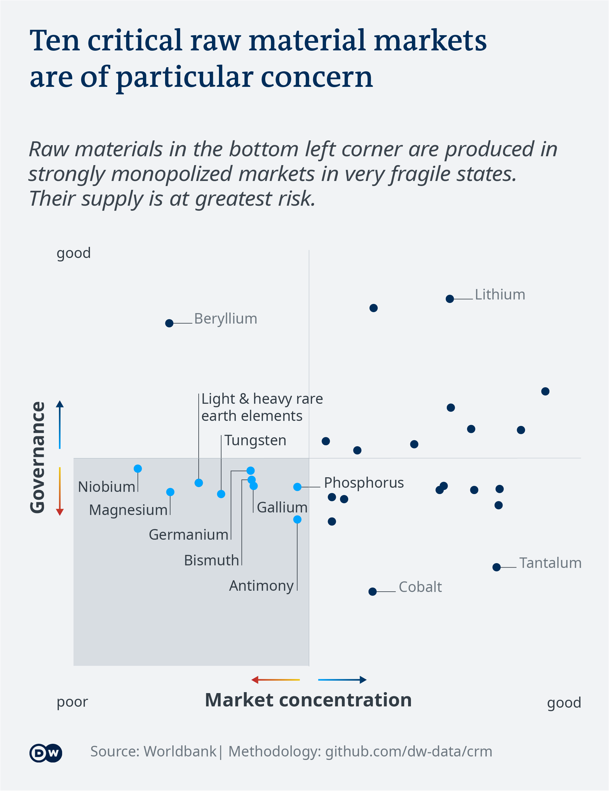

# Critical raw materials

_Idea, research, data analysis, data visualization and writing:_  [Michel Penke](https://michelpenke.de)

**Read the full articles on DW.com:**
- [Deposits and markets](https://www.dw.com/en/xxx)
- [Demand and substitution](https://www.dw.com/en/xxx)
- [Environment damage and human rights violation](https://www.dw.com/en/xxx)

The so-called critical raw materials are thirty resources identified by the European Union that are irreplaceable for its future industry. 

DW analyzed the production, market distortion, future demand, alternative elements, environmental damages and human rights violations during the mining process.  

The following text will explain the process behind this story: Which data sources were used, how the analysis was conducted and how the data was visualized.

# Source data

| **Data** | **Source** | **Link** |
| --- | --- | --- |
| List of CRM | EU Commission| [Communication from the Commission to the European Parliament, the Council, the European Economic and Social Committee and the Committee of the Regions](https://eur-lex.europa.eu/legal-content/EN/TXT/?uri=CELEX:52020DC0474)|
| CRM Supply risk | EU Commission| [EU Science Hub](https://rmis.jrc.ec.europa.eu/?page=crm-list-2020-e294f6)|
| Location of CRM deposits I | USGS | [USMIN mineral deposit database](https://mrdata.usgs.gov/general/map-global.html#home)|
| Location of CRM deposits II | ROSYS | [Rohstoffinformationssystem](https://rosys.dera.bgr.de/mapapps/resources/apps/rosys/index.html)|
| CRM Trade Data | OEC| [Country reports](https://legacy.oec.world/en/resources/data/)|
| World Governance Index| WGI | [WGI](https://info.worldbank.org/governance/wgi/)|
| Fragil State Index | FSI | [FSI](https://fragilestatesindex.org/data/)|
| Environmental Performance Index | EPI| [EPI](https://epi.yale.edu/epi-results/2020/component/epi)|
| CRM Future demand & Usage| EU Commission | [Critical Raw Materials for Strategic Technologies and Sectors in the EU](https://rmis.jrc.ec.europa.eu/uploads/CRMs_for_Strategic_Technologies_and_Sectors_in_the_EU_2020.pdf)|
| CRM Usage & Recycling | EU Commission | [Report on Critical Raw Materials and the Circular Economy](http://publications.europa.eu/resource/cellar/d1be1b43-e18f-11e8-b690-01aa75ed71a1.0001.01/DOC_1)|
| CRM Toxicity I | Federal Environmental Agency | [Weiterentwicklung von Handlungsoptionen einer ökologischen Rohstoffpolitik ÖkoRess II](https://www.umweltbundesamt.de/sites/default/files/medien/1410/publikationen/2020-06-17_texte_79-2020_oekoressii_abschlussbericht.pdf)|
| CRM Toxicity II | Fraunhofer Society| [Analyse kritischer Rohstoffe für die Landesregierung Baden-Würtemberg](https://um.baden-wuerttemberg.de/fileadmin/redaktion/m-um/intern/Dateien/Dokumente/2_Presse_und_Service/Publikationen/Wirtschaft/2014_Studie_Analyse_kritischer_Rohstoffe_fuer_die_Landesstrategie_BW.pdf)|

# Analysis
### Mapping the deposits
The first part of the analysis was to map the deposit area which are currently mined. Untapped deposits were ignored. The geographical data comes from the [USMIN mineral deposit database](https://mrdata.usgs.gov/general/map-global.html#home) and the German [Rohstoffinformationssystem](https://rosys.dera.bgr.de/mapapps/resources/apps/rosys/index.html). 

There are three colored layers that indicated the importance of the deposit. All thirty raw material markets were analyzed individually and their mining areas mapped. In case the market share of the mining country were above 66 percent of one of the thirty markets they were colored in dark blue. Medium blue stands for 33 percent and above and light blue for below 33 percent.

_Caveats: There is no scientific figure or score that states when a player in a market starts to control or dominate the whole system and therefore has a "high" or "low" importance - to find an approximation nevertheless, we translated a market concentration as outlined above. Furthermore, the quality of the data about mining locations is difficult to estimate. The known mines differ from source to source and were never complete. Therefore, two sources had to been matched._
### Analyzing the importance of market shares
An overall analysis calculated the market shares of all top ten mining nations in all thirty CRM markets each and summed them up. In case there were more than ten mining nations all minor miners were ignored. 

_Caveats: There are multiple partly contradictory data sets about the market shares of global CRM production._ 
### Trade risks
To visualize the trade risks two aspects needed to be taken into account. One, the market distortion since trading partners are more dependent if only one or just a small number of players control big market shares. Two, the reliability of the local government, the rule of law and other stabilizing social factors which are crucial for a prosperous trade relation. 

A suitable approach to quantify the market distortion is the [Herfindahl index (HHI)](https://journals.sagepub.com/doi/10.1177/0003603X9504000206). It is a measure of the size of players in a market and how they relate to each other. HHI is defined as the sum of the squares of the players' shares within the market. 

The HHI score can be normalized to make it independent of the amount of _n_. Whereas the Herfindahl index ranges from 1/_n_ to one, the normalized Herfindahl index ranges from 0 to 1. It is computed as:

The second factor, the reliability of the local government and economic stability, was easily numbered with the [Good governance index (WGI)](https://info.worldbank.org/governance/wgi/). Therefore, the WGI of each mining nation was weighted due to their market share and summed to get a WGI of the whole market for each CRM. The WGI score ranges from 0 to 100 with 100 being the best. 

_Caveats: It could be disputed if the WGI is the best source to quantify the reliability of a state system to guarantee a stable trade environment. Nevertheless the WGI was chosen over, for example, the [Fragile state index](https://nationalinterest.org/blog/the-buzz/the-fatally-flawed-fragile-states-index-10878) because it is accepted by experts and seen as a largely objective rating of the state of states. Furthermore, the text states that there are ten CRMs that are of high risk because they show a high market distortion and a low WGI. The methodological thresholds were 0.5 for HHI and 50 for WGI. These thresholds could be set differently which would result in another outcome in which CRMs' trade risks are high. If the thresholds were set higher, for example 0.6 for HHI and 40 for WGI, then none of the CRMs would be classified as risky. If the threshold were lower, for example 0.4 for HHI and 60 for WGI , the number of risky CRM markets would rise to fifteen. Nevertheless, given that all CRM markets show an unusual high concentration a value below 0.5 seems not helpful because most of the thirty commodities quickly fall under it. On the other hand, a HHI threshold of 0.6 and above already describes a scenario with one supplier of at least 80 percent market share. This could already be called a monopoly.  The WGI treshold of 50 seems reasonable for the author since countries like Rwanda, Cuba and Argentinia, whose scores were all near this value in 2019, are all examples for semi indispensable suppliers. They could continue to be stable exporteurs or fall away as trading partners due to political unrest, trade embargos or state bankruptcies._
### Usage
The data source for the usage sectors is an [EU Commission's study](https://rmis.jrc.ec.europa.eu/uploads/CRMs_for_Strategic_Technologies_and_Sectors_in_the_EU_2020.pdf). 

### Future demand
The data originates from the same [EU Commission's study](https://rmis.jrc.ec.europa.eu/uploads/CRMs_for_Strategic_Technologies_and_Sectors_in_the_EU_2020.pdf). Three scenarios are described in the study. The high-demand scenario is visualized in the chart while the low-demand scenario is mentioned in the DW article right next to it. 

_Caveats: Future demand depends heavily on technological development. Even small changes in the industry may result in large shifts to other resources or in an increase or a decrease of individual CRMs._
### Recycling
The data for the recycling rates comes from an [EU Commission's study](http://publications.europa.eu/resource/cellar/d1be1b43-e18f-11e8-b690-01aa75ed71a1.0001.01/DOC_1). 

### Toxicity
To visualize toxicity two variables were compared: The toxicity of the mining process of each CRM and the capability of a nation to deal with the damage that may result from the process. Two nations that both mine a resource but differ in their efforts to eliminate the consequences have to be treated differently. They appear as separate dots in the chart, with the same position on the x axis but a varying position on the y axis, based on the environmental performance of the mining country. 
The data for the resource toxicity comes from a study of the German [Federal Environmental Agency](https://www.umweltbundesamt.de/sites/default/files/medien/1410/publikationen/2020-06-17_texte_79-2020_oekoressii_abschlussbericht.pdf) while the numbers for the nations' environmental efforts are based on the [Environmental performance index (EPI)](https://epi.yale.edu/epi-results/2020/component/epi). The toxicity is grouped categorically from low to high. The EPI is, as usual, quantified in a range from 0 till 100 with 100 being the best. 

_Caveats: To categorize the toxicity of a raw material is difficult and the way how EPI does can easily be disputed. Whether the toxicity for the human body, the CO2 emissions or the mining in the natural habitat of endangered species should be part of this index and how they should be weighted is a debatable decision. Nevertheless, the [aggregation and weighting of the EPI](https://epi.yale.edu/downloads/epi2020technicalappendix20200803.pdf) is excepted within the scientific community. Besides, the study of the Fraunhofer Society doesn't deliver a categorization for all CRMs._

